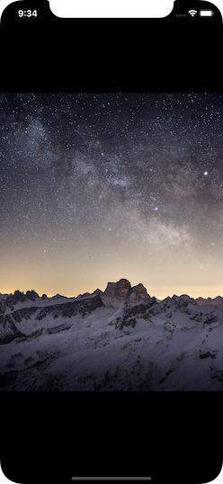

# About SinglePhoto 🌌

This app is a project Apple's "Intro to App Development with Swift" book, Lesson 5: First App, pages 22-44.

Original link: [Intro to App Development with Swift](https://books.apple.com/ca/book/intro-to-app-development-with-swift/id1118575552)

## Concepts 💡
- Getting familiar with Xcode
- Display a single image in the View Controller using Interface Builder

## Screenshots 📸

Enjoy! ☺️

