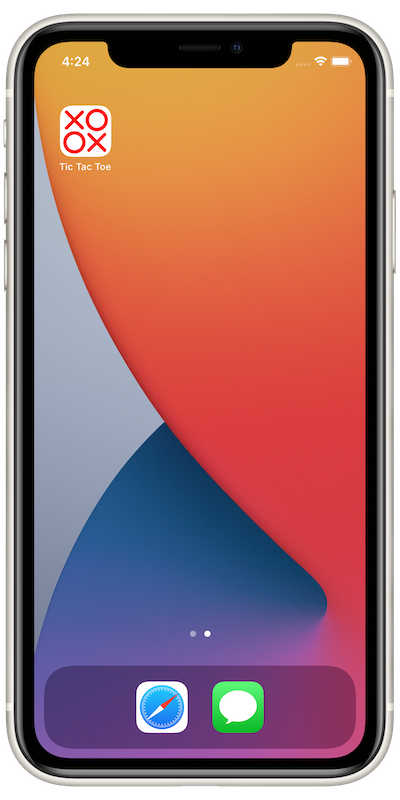

# Tic Tac Toe - SwiftUI 🐦

Tic Tac Toe is a game built using Apple Inc.'s [SwiftUI](https://developer.apple.com/xcode/swiftui/) framework. User will play against the computer AI to either win, lose, or draw the game.

The game supports every iOS or iPadOS device running version 13.0 or later.

## Tools and Concepts used

* SwiftUI
* MVVM (Model-View-ViewModel) oriented architecture
* Xcode built-in refactoring tools
* iOS built-in haptic feedback engine

## Usage

Clone [this GitHub repo](https://github.com/rungxanh2901/joescode.git), then navigate to directory /joescode/SwiftPetProjects/Tic Tac Toe, open the Xcode project file and run it on a Simulator or actual iOS device.

## Screenshots

## Acknowledgement
Special thanks to iOS developer [Sean Allen](https://twitter.com/seanallen_dev) for the app ideas and tutorial.

Detailed info can be found [here on YouTube](https://www.youtube.com/watch?v=MCLiPW2ns2w&t=3286s).

## License
[MIT](https://choosealicense.com/licenses/mit/)
