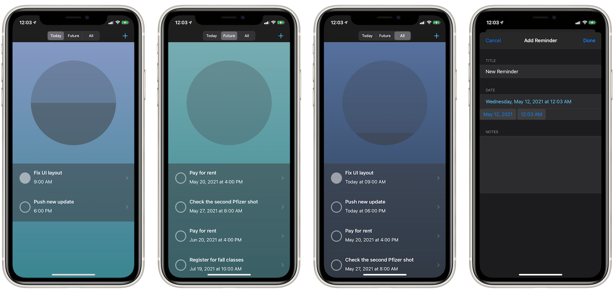

# Today App
## About
Today App is a reminders manager, drawing data from users' existing reminders (upon authorization).

Don't turn away yet, I know, because Today let's you mark off your everyday reminders in a calm, relaxed, gamified vibe with its soothing UI design; instead of stressing you out.

Today only syncs reminders with an attached alarm to keep you in the know of when to have them done.

## Concepts Utilized
* MVC-oriented (Model-View-Controller) architecture
* Data Sources
* EKEventStore
* EKReminder
* DateFormatter
* Storyboard/AutoLayout
* UISegmentedControl
* UIFeedbackGenerator

## Screenshots

## Acknowledgement
Today App is a code-along project under the tutorial from Apple Developer [here](https://developer.apple.com/tutorials/app-dev-training/getting-started-with-today).

Additionally, I added my spin to Today to extend its functionality beyond the original scope of the tutorial.
